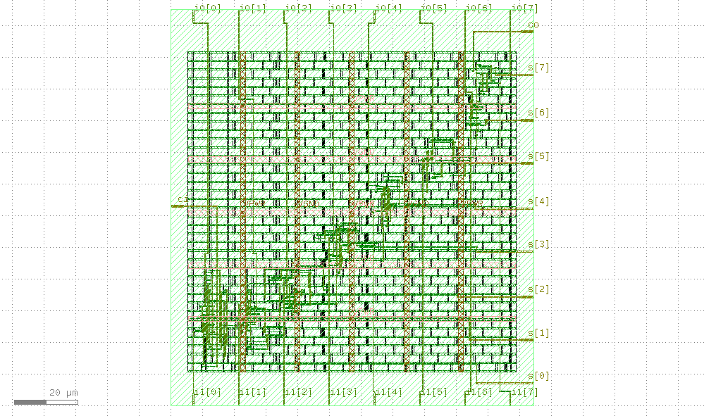

# adder
Adder in VHDL to test the digital flow using ghdl + GTKwave (front-end) and openlane (back-end).

## Task definition
1. Test GHDL + GTKWave (Front-end) using the classic full adder (reference: http://ghdl.free.fr/ghdl/A-full-adder.html)
2. Use Yosys + GHDL (ghdl-yosys-plugin) to convert the VHDL design in to a .v (Verilog) equivalent code to be the starting point to openlane flow. (see write_verilog reference: https://github.com/ghdl/ghdl/issues/1174)
3. Use openlane (Back-end) to generate the layout (.gds) from previously generated .v (design file). Ref: https://github.com/efabless/openlane
4. Repository documentation

## The adder


The system consists on the implementation of the classic digital adder.

### Files

Files              | Description
------------------ | ------
full_adder.vhd     | Description of the behaviour of the full adder.
full_adder_tb.vhd  | Full adder testbench.
adder.vhd          | Decription of the 8-bit adder implemented using full adder.
adder_tb.vhd       | 8-bit adder testbench.

### Simulations

#### Requirements

- [GHDL](http://ghdl.free.fr/)

#### Procedures

```bash

# Design analysis of the sources
$ ghdl -a ./src/vhdl/full_adder.vhdl
$ ghdl -a ./src/vhdl/adder.vhdl

# Design analysis of the testbenches
$ ghdl -a ./src/vhdl/full_adder_tb.vhdl
$ ghdl -a ./src/vhdl/adder_tb.vhdl

# Test units elaboration
$ ghdl -e full_adder_tb
$ ghdl -e adder_tb

# Execute the simulation and export the waveforms
$ ghdl -r full_adder_tb --wave=./waves/full_adder_tb.ghw
$ ghdl -r adder_tb --wave=./waves/adder_tb.ghw

```

### Waveforms

#### Requirements

- [GTKWave](http://gtkwave.sourceforge.net/)

#### Procedures

```bash 

# full_adder
$ gtkwave ./waves/full_adder_tb.ghw

# adder
$ gtkwave ./waves/adder_tb.ghw

```

#### Screenshots


### VHDL -> Verilog

#### Requirements

- [Yosys](http://www.clifford.at/yosys/)
- [GHDL](http://ghdl.free.fr/)
- [ghdl-yosys-plugin](https://github.com/ghdl/ghdl-yosys-plugin)

#### Procedures

```bash

# full_adder
$ yosys -m ghdl -p 'ghdl ./src/vhdl/full_adder.vhdl -e full_adder; write_verilog full_adder.v'

# adder
$ yosys -m ghdl -p 'ghdl ./src/vhdl/adder.vhdl -e adder; write_verilog adder.v'

```

#### Observations

Due to some installation problems related to [ghdl-yosys-plugin](https://github.com/ghdl/ghdl-yosys-plugin) natively, we used a image [hdlc/ghdl:yosys](https://hub.docker.com/r/hdlc/ghdl/tags) and the [Docker](https://www.docker.com/) to execute the procedures.

```bash

# Download the image
$ docker pull hdlc/ghdl:yosys

# Mount the container
$ docker run --rm -it -v $(pwd):/home -w /home -u $(id -u $USER):$(id -g $USER) hdlc/ghdl:yosys bash

# Execute the commands inside the container
$ yosys -m ghdl -p 'ghdl ./full_adder.vhdl -e full_adder; write_verilog full_adder.v'
$ yosys -m ghdl -p 'ghdl ./adder.vhdl -e adder; write_verilog adder.v'

```

### Verilog -> GDSII

#### Requirements

- [Openlane](https://github.com/efabless/openlane)
- [Docker](https://www.docker.com/)

#### Procedures

```bash

# Access the openlane local installation directory (e.g.)
cd ~/sky130_skel/openlane

# Mount the container image(e.g. openlane:rc6)
$ docker run --rm -it -v $(pwd):/openLANE_flow -v $PDK_ROOT:$PDK_ROOT -e PDK_ROOT=$PDK_ROOT -u $(id -u $USER):$(id -g $USER) openlane:rc6 

# Begin a new design 'adder'
$ ./flow.tcl -design adder -init_design_config

# Exit the container
$ exit
```

After the above procudure, the file `./designs/adder/config.tcl` needs to be edited as mentioned [on this repo](./config.tcl). Also, due to the design be small, some problems can occur on the *placement* stage, as explicited [here](https://github.com/efabless/openlane/wiki#how-to-add-a-small-design). So, we needed the following configurations:

```bash

# configuration added to the file: ./configuration/floorplan.tcl [inside the openlane directory]
set ::env(FP_CORE_UTIL) 5

# configuration added to the file: ./configuration/placement.tcl [inside the openlane directory]
set ::env(PL_TARGET_DENSITY) 0.5

```

After those configurations it is needed to access the openlane directory root with the final procedures:

```bash

# Copy the 'Verilog' files to the design folder inside the openlane directory
$ cp -r ./src/verilog ~/sky130_skel/openlane/designs/adder/src

# Access the openlane local installation directory (e.g.)
$ cd ~/sky130_skel/openlane

# Init the flow
$ docker run --rm -v $(pwd):/openLANE_flow -v $PDK_ROOT:$PDK_ROOT -e PDK_ROOT=$PDK_ROOT -u $(id -u $USER):$(id -g $USER) openlane:rc6 ./flow -design adder -tag openlane_run

```
This will generate the layout automatically.

#### Screenshots


<p align="center">staydh - 2021</p>
