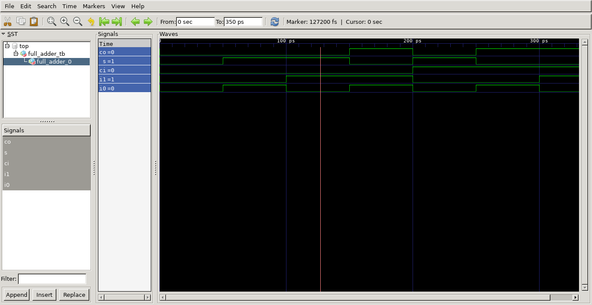

# adder
Somador em VHDL para teste do fluxo digital com front-end (ghdl + GTKwave) e back-end (openlane).

## Definição da tarefa
1. Testar o fluxo GHDL + GTKWave (Front-end) usando somador completo (Pode utilizar a referência http://ghdl.free.fr/ghdl/A-full-adder.html)
2. Utilizar Yosys + GHDL para converter o código para um .v (Verilog) equivalente, de modo a utilizar no fluxo openlane. (Ver e-mail e referências com write_verilog: https://github.com/ghdl/ghdl/issues/1174)
3. Utilizar o openlane (Back-end) para gerar o layout (.gds) por meio do .v (design file). Refs: https://github.com/britovski/vsdOpenLANE e https://github.com/efabless/openlane
4. Documentar no repositório.

## Somador

O sistema consistiu na implementação do clássico projeto de somador digital.

Arquivo    | Descrição
---------- | ------
full_adder | Descrição do comportamento do clássico circuito somador-completo.
full_adder_tb  | Testbench do somador completo
adder  | Decrição de um somador clássico de 8 bits, implementado a partir do somador completo.
adder_tb  | Testbench do somador de 8 bits.

### ghdl

Análise de arquivo de descrição: `ghdl -a file.vhdl`

Elaboração de unidade: `ghdl -a unit`

Excutar simulação: `ghdl -r unit`

Exportar formas de ondas: `ghdl --wave=wave.ghw`

## Testes e formas de ondas

### Simulação do Somador completo

### Simulação do Somador de 8 bits

### gtkwave

Analizar formas de ondas: `gtkwave wave.ghw`
